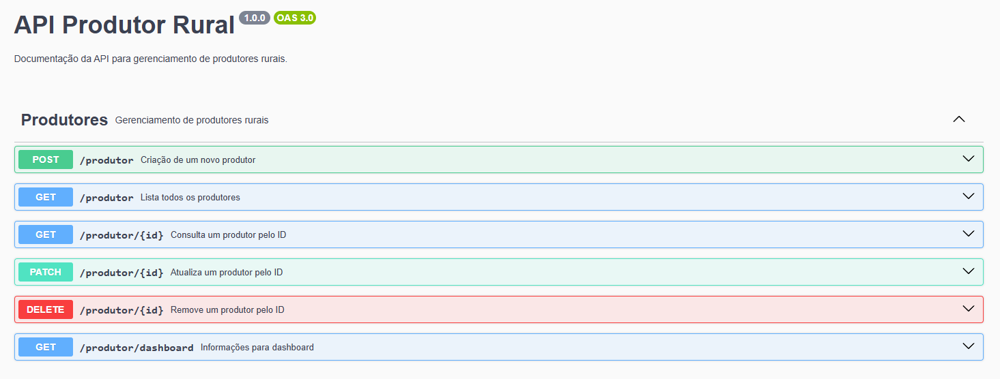

# express-crud

Uma simples API RESTful para gerenciamento de produtores rurais (CRUD - Create, Remove, Update and Delete).

Essa API é construída utilizando as seguintes linguagens, tecnologias e ferramentas: **Express.js**, **TypeScript**, **Docker**, **PostgreSQL** e **boas práticas de desenvolvimento**.

## Rodar o projeto

Instale as dependências:

```bash
yarn install
```

Configure as variáveis de ambiente no arquivo `.env` de acordo com as informações do arquivo `.env.example`.

Inicie a aplicação com o seguinte comando:

```bash
./start.sh logs
```

Ou se desejar:

```bash
docker-compose up
```

> **Obs:** Após iniciar a aplicação deve aparever a mensagem `Connected with database...`, se isso não acontecer, tente rodar a API novamente.
>
> Na primeira execução a API pode iniciar antes do Banco de Dados.

Execute as migrations (Para criar as tabelas e enums no banco de dados caso ainda não existam):

```bash
yarn migration:run
```

> **Obs:** Esse comando acessará o docker e executará a migration, pois somente assim é possível acessar as ENVs do Banco de Dados utilizando docker.

## Rotas da API

Todas as rotas estão descritas no arquivo `sample/produtor.http` e também estão disponíveis no **swagger** (Rota GET `/docs`), como apresentado na imagem abaixo:



## Testes

Para realizar os testes unitários da API execute o seguinte comando:

```bash
yarn test
```

## Dicas

Criar uma nova migration: `yarn typeorm migration:create src/migrations/MigrationName`

[Gerador de CPF](https://www.4devs.com.br/gerador_de_cpf)

[Gerador de CNPJ](https://www.4devs.com.br/gerador_de_cnpj)

## Bibliotecas

Algumas bibliotecas interessantes que foram utilizadas nesse projeto:

- `express` > Framework base do projeto para construção da API.
- `typescript` > Superset do JavaScript para tipagem estática.
- `typeorm` > ORM para manipulação de bancos de dados (Nesse caso PostgreSQL).
- `ts-node-dev` > Reinicia automaticamente o servidor ao salvar arquivos.
- `class-validator` > Validação dos parâmetros application/json enviados via request.
- `cpf-cnpj-validator` > Biblioteca para validação de CPF e CNPJ.
- `jest` > Framework para testes unitários.
- `supertest` > Realiza testes em endpoints HTTP.

Bibliotecas interessantes para serem utilizadas no futuro:

- [routing-controllers](https://github.com/typestack/routing-controllers) > Construção de rotas com decorators
